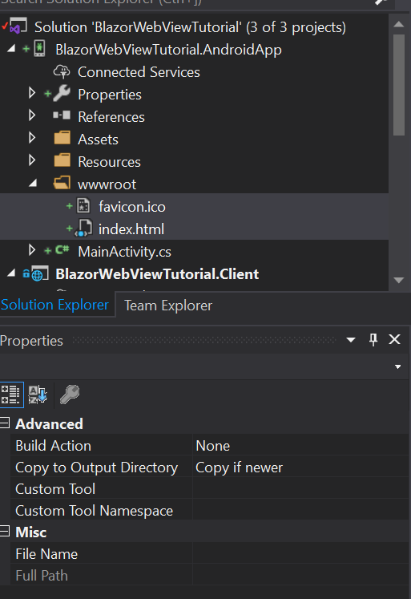

# Android

We will base our Android app on the [preparations](prepare.md) we have done before.
The preparations involved bringing over our Blazor App into a Razor Class Library (RCL).
This way we can share all of the application code between all the native apps we are
creating in these tutorials. The code for the start can be found in
[this branch](https://github.com/jspuij/BlazorWebViewTutorial/tree/1_prepare).

## Add a Xamarin Android project

Let's start by adding a Xamarin Android project to the solution. Perform the following
steps to add a new Android project to the solution. Right click on the solution node in
the solution explorer and select `Add` -> `New project...`. This will open the following
dialogs:

# [Add Android Project 1](#tab/addandroid-1)


# [Add Android Project 2](#tab/addandroid-2)


# [Add Android Project 3](#tab/addandroid-3)


***

> However tempting, don't have your project name contain ".Android" somewhere. It will
conflict with the global `Android` namespace from Xamarin itself. I used "AndroidApp" as
project suffix, which is safe.

Make sure you choose the (Native) Android App template and not the Xamarin Forms Android
template for this tutorial. Finally select the "Blank App" template in the final dialog.
A new project will be added to the solution. Set the android project as startup project
and Press F5 to start the android emulator and make sure everything works before we start
adding the blazor bits to the android project. You can keep the emulator running, it
is a lot faster to debug this way if neccessary.

> It is possible to use native view in a Xamarin Forms app. It is however outside of
the scope of this tutorial. More information can be found in the 
[xamarin documentation](https://docs.microsoft.com/en-us/archive/msdn-magazine/2016/connect/mobile-embedding-native-views-in-your-xamarin-forms-apps)

## Adding references.

We start by adding a reference to the Shared project from the Android project. Click
right on the references node of the Android project and select `Add reference...`.
Select the shared RCL project from the projects list and click "OK".

Now that we have references the Shared RCL project, it's time to install the NuGet
package for the BlazorWebView for android. Enter the following lines into the package
console:

```
PM> Install-Package BlazorWebView.Android -IncludePrerelease
```

This should install the package. We need an HttpClient for this platform, 
so we install `System.Net.Http` from nuget:

```
PM> Install-Package System.Net.Http
```

Optionally you can update the Xamarin.Essentials NuGet package in the project, because
the default template comes with a very old version. Rebuild the project, 
there should be no build errors.

> There is a build warning however, warning MSB3277: Found conflicts between different
versions of "System.Numerics.Vectors" that could not be resolved. This is because of
the incompatibility of System.Text.Json on Xamarin platforms. Two bugs are tracked
[here](https://github.com/xamarin/Essentials/issues/904) and
[here](https://github.com/dotnet/runtime/issues/31326). The use of the serializer luckily
is limited enough that Blazor works on iOS. You are encouraged to use newtonsoft JSON for
now if you want to do serialization for HTTP calls and you experience issues.

Lets continue to the next step.

## Copy wwwroot files

We need a wwwroot folder and an index.html for this project as well. Let's copy the wwwroot
folder from the WebAssembly client project to the Android project. Now that we have added
the wwwroot folder with the index.html file (and favicon to prevent a 404), we have to change
the properties of these files:

* Change <strong>BuildAction</strong> from `Content` to `None`
* Change <strong>Copy To Outputdirectory</strong> from `Do not Copy` to `Copy if newer`

The project should look like this:



> The wwwroot folder from the Android project will be combined with the Static assets of
the razor class libraries into a zipfile called wwwroot.zip. This zipfile is added to the
Android assets during the build process. It has to be zipped because android assets are
very limited in their filename and folder structure. At first start of the application,
the zipfile is extracted to the personal data folder of the app.

## change index.html

We need to change the name and location where the framework script is loaded from.
BlazorWebView will intercept urls loaded from the `framework://` scheme and present the
content directly to the native operating webview. We will load the blazor javascript
file from the following location:

`framework://blazor.desktop.js`

Change the index.html file inside
the wwwroot folder of the Android project to read:

```html
<!DOCTYPE html>
<html>

<head>
    <meta charset="utf-8" />
    <meta name="viewport" content="width=device-width, initial-scale=1.0, maximum-scale=1.0, user-scalable=no" />
    <title>BlazorWebViewTutorial.Client</title>
    <base href="/" />
    <!-- Add _content/BlazorWebViewTutorial.Shared below -->
    <link href="_content/BlazorWebViewTutorial.Shared/css/bootstrap/bootstrap.min.css" rel="stylesheet" />
    <link href="_content/BlazorWebViewTutorial.Shared/css/site.css" rel="stylesheet" />
</head>

<body>
    <app>Loading...</app>

    <div id="blazor-error-ui">
        An unhandled error has occurred.
        <a href="" class="reload">Reload</a>
        <a class="dismiss">🗙</a>
    </div>
    <!-- change the script location -->
    <script src="framework://blazor.desktop.js"></script>
</body>

</html>
```

## Preparing the Main Activity

The android app has a single activity that is called MainActivity. It consists of two
parts:

* A resource xml file called "activity_main.xml" inside the `Resources/layout` subfolder
  of the project.
* The "MainActivity.cs" file in the root of the Android App project.

We need to update the first to add the "BlazorWebView" fragment to the layout, then we
update the second one to wire up the BlazorWebView to show our Blazor App.

### Adding the BlazorWebView Fragment.

Open the "activity_main.xml" file by double clicking it. We need to add a fragment to
it, where the blazor content will be rendered. The file should read like this when done:

```xml
<RelativeLayout xmlns:android="http://schemas.android.com/apk/res/android"
    xmlns:app="http://schemas.android.com/apk/res-auto"
    xmlns:tools="http://schemas.android.com/tools"
    android:layout_width="match_parent"
    android:layout_height="match_parent">
<!-- The fragment begins here. -->
 <fragment
        android:name="BlazorWebView.Android.BlazorWebView"
        android:layout_width="match_parent"
        android:layout_height="match_parent"
        android:minWidth="25px"
        android:minHeight="25px"
        android:id="@+id/blazorWebView" />
<!-- The fragment ends here. -->
</RelativeLayout>
```

We have added a fragment with the type `BlazorWebView.Android.BlazorWebView`, that matches
its parent in height and width, and we have given it the `blazorWebView` id. We will need
that id later to reference the fragment in the code behind.
Close the designer and build the project, it should still build.

### Wire up the blazorWebView fragment.

Open the MainActivity.cs file in the text editor. First we need to add two namespaces
<em>inside</em> the namespace of the file (to avoid naming conflicts) like so:

```csharp
namespace BlazorWebViewTutorial.AndroidApp
{
    // add usings here
    using BlazorWebView.Android;
    using BlazorWebView;
```

To be able to reference the blazorview inside the `MainActivity` class and to be able
to dispose the blazor host we add two private fields to the class:

```csharp
    [Activity(Label = "@string/app_name", Theme = "@style/AppTheme", MainLauncher = true)]
    public class MainActivity : AppCompatActivity
    {
        private BlazorWebView blazorWebView;

        private IDisposable disposable;
```

Now we are ready to assign the BlazorWebView fragment to the field and initialize blazor.
We do this by adding the following two statements to the `OnCreate` method of the class:

```csharp
            this.blazorWebView = (BlazorWebView)this.SupportFragmentManager.FindFragmentById(Resource.Id.blazorWebView);

            // run blazor.
            this.disposable = BlazorWebViewHost.Run<Startup>(this.blazorWebView, "wwwroot/index.html", new AndroidAssetResolver(this.Assets, "wwwroot/index.html").Resolve);
```

The first line will assign the `blazorWebView` field by looking up its instance through the SupportFragmentManager of
the android activity. Fragment instances that were created by inflating the xml layout have to be requested from the
SupportFragmentManager by id.
The second line will start Blazor. We'll take it apart step by step, to see what is going on:

* The result of the assignment is a Disposable instance that can be used to tear down and cleanup blazor. We should save it
  and call dispose when the activity is destroyed. 
* We start blazor by calling the Run method on the `BlazorWebViewHost` static class. The run method takes a generic type that
  specifies the Startup class that will initialize blazor. We still use a Startup class, although Blazor WebAssembly has moved
  away from it. This might change in the future, but for now we keep the Startup class. We will define a Startup class in the
  next chapter.
* The first argument to the run method is the `IBlazorWebView` instance for the platform that we will use. In this case it's
  the blazorWebView instance that we got from the SupportFragmentManager. 
* The second argument is the relative path to the index.html resource inside the project. It usually is index.html and it has
  to be the wwwroot folder.
* The third argument is the resolve method of a specific asset resolver for the platform. For a lot of platforms, the wwwroot
  folder can be copied to a location somewhere inside the published output or inside the bundle. For Android assets however
  a special resolver is neccessary that extracts a zipped asset from the apk and inflates it into the personal folder of the
  device on first startup.

The Blazor app has its own action bar to navigate, so the default Android action bar should be hidden. It is useless as we have
a single android activity anyway. Add the following statement to the `OnCreate` method as well to hide the action bar:

```csharp
            this.SupportActionBar.Hide();
```

We have to make sure that we clean up nicely when the activity is destroyed, so we add the following method to the `MainActivity`
class:

```csharp
        protected override void OnDestroy()
        {
            if (this.disposable != null)
            {
                this.disposable.Dispose();
                this.disposable = null;
            }
            base.OnDestroy();
        }
```

Now we need to resolve some usings, but after we have done this the final version of the `MainActivity.cs` should look like this:

```csharp
using Android.App;
using Android.OS;
using Android.Support.V7.App;
using Android.Runtime;
using Android.Widget;
using System;

namespace BlazorWebViewTutorial.AndroidApp
{
    // add usings here
    using BlazorWebView.Android;
    using BlazorWebView;

    [Activity(Label = "@string/app_name", Theme = "@style/AppTheme", MainLauncher = true)]
    public class MainActivity : AppCompatActivity
    {
        private BlazorWebView blazorWebView;

        private IDisposable disposable;

        protected override void OnCreate(Bundle savedInstanceState)
        {
            base.OnCreate(savedInstanceState);
            Xamarin.Essentials.Platform.Init(this, savedInstanceState);
            // Set our view from the "main" layout resource
            SetContentView(Resource.Layout.activity_main);

            this.SupportActionBar.Hide();
            this.blazorWebView = (BlazorWebView)this.SupportFragmentManager.FindFragmentById(Resource.Id.blazorWebView);

            // run blazor.
            this.disposable = BlazorWebViewHost.Run<Startup>(this.blazorWebView, "wwwroot/index.html", new AndroidAssetResolver(this.Assets, "wwwroot/index.html").Resolve);
        }

        protected override void OnDestroy()
        {
            if (this.disposable != null)
            {
                this.disposable.Dispose();
                this.disposable = null;
            }
            base.OnDestroy();
        }

        public override void OnRequestPermissionsResult(int requestCode, string[] permissions, [GeneratedEnum] Android.Content.PM.Permission[] grantResults)
        {
            Xamarin.Essentials.Platform.OnRequestPermissionsResult(requestCode, permissions, grantResults);

            base.OnRequestPermissionsResult(requestCode, permissions, grantResults);
        }
    }
}
```

Well done, you've implemented the MainActivity, so we can move on to the final bit of this tutorial, which
is implementing the `Startup` class.

## Implementing the Startup class.

We have to wire up the Blazor Dependency injection and define the root App class for Blazor to be able to run.
This Startup class closely resembles the AspnetCore default startup class for a web application.
We could define it in the shared project, but as it most likely will contain DI registrations specific to
the platform, a better place is the android project. Let's add the following class to the android project:

```csharp
using System.Net.Http;

using BlazorWebView;
using BlazorWebViewTutorial.Shared;
using Microsoft.Extensions.DependencyInjection;

namespace BlazorWebViewTutorial.AndroidApp
{
    public class Startup
    {
        public void ConfigureServices(IServiceCollection services)
        {
            services.AddScoped<HttpClient>();
        }

        /// <summary>
        /// Configure the app.
        /// </summary>
        /// <param name="app">The application builder for apps.</param>
        public void Configure(ApplicationBuilder app)
        {
            app.AddComponent<App>("app");
        }
    }
}
```

The startup class has two methods. The first method configures the services
for the DI container. We add an `HttpClient` from System.Net.Http as the
Android platform does not come with a built-in one.

The second method is the configuration for the platform. The method accepts
an application builder that can be used to add the root component for the
app.

Press F5 to build and run the project. You should be greeted by a familiar
Blazor application:


## Fixing the last runtime issue.

When you navigate to the fetch data page, you'll notice that the data is no
longer shown. The data is included inside the android APK, but the HttpClient
that we have added to the DI container is outside of the browser and won't be
intercepted by the BlazorWebView. Let's get it from github directly
to solve this issue. Change the `Oninitialized` method inside FetchData.Razor
component in the shared RCL project to read:

```csharp
    protected override async Task OnInitializedAsync()
    {
        forecasts = await Http.GetJsonAsync<WeatherForecast[]>("https://raw.githubusercontent.com/jspuij/BlazorWebViewTutorial/master/BlazorWebViewTutorial.Shared/wwwroot/sample-data/weather.json");
    }
```

The android app should now be fully functioning. The source for the android app
is in this branch:

https://github.com/jspuij/BlazorWebViewTutorial/tree/2_android
