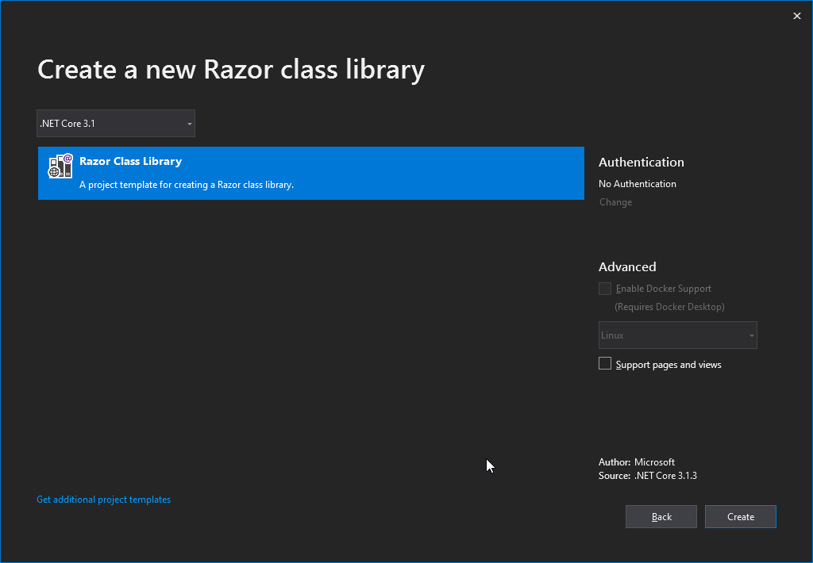

# Prepare a Blazor Project.

We start preparations by generating a new Blazor WebAssembly Project from Visual Studio.
Make sure you have the WebAssembly Templates installed by following the [instructions in the
documentation](https://docs.microsoft.com/en-us/aspnet/core/blazor/get-started?view=aspnetcore-3.1&tabs=visual-studio).

>We will use a WebAssembly Project for these preparations, but the steps for Server Side
Blazor are roughly the same.

Create a new project using the settings below:

# [Create Page 1](#tab/createpage-1)


# [Create Page 2](#tab/createpage-2)


# [Create Page 3](#tab/createpage-3)


***

## Add a Shared RCL Project.

To prepare a Blazor Project for use with a BlazorWebView it is best to move all dynamic
Blazor content to a Razor Class Library, and keep only the static content inside the
WebAssembly Project. We do this by adding a new project to the solution first:

# [Add Project 1](#tab/addpage-1)


# [Add Project 2](#tab/addpage-2)


# [Add Project 3](#tab/addpage-3)


# [Add Project 4](#tab/addpage-4)



***

Do not tick the option to support Pages and Views, as this is for Razor Pages, a 
server-side technology that has nothing to do with Blazor.
We can delete all content that has been generated as an example in the RCL Project,
as we will move over the content from the WebAssembly Project shortly. Don't delete
the wwwroot folder itself, we will use that later on.

Finally add a reference from the WebAssembly Project to the RCL Project:

  * Right-click `Dependencies` node in the solution explorer of the WebAssembly Project.
  * Select `Add reference...`
  * In the dialog that is opened, click `Projects` and `Solution`.
  * Select your shared RCL Project.

## Move over the Necessary Files and Folders.

Now move over the following items from the WebAssembly project to the shared RCL Project,
leaving only the favicon.ico and index.html files in the wwwroot behind:

* Pages
* Shared
* _Imports.razor
* App.razor
* wwwroot/css
* wwwroot/sample-data

You'll arrive at the following structure:


## Clean up the Build Errors.

Now build your solution. You'll get a list of build errors that need to be addressed:


We will fix these one by one:

* First, we change the namespaces in `_Imports.Razor` to match the shared library instead of
  the WebAssembly Project:

```cshtml-razor
@using System.Net.Http
@using Microsoft.AspNetCore.Components.Forms
@using Microsoft.AspNetCore.Components.Routing
@using Microsoft.AspNetCore.Components.Web
@using Microsoft.JSInterop
<!-- change these last two lines to match the namespaces of your shared library !-->
@using BlazorWebViewTutorial.Shared
@using BlazorWebViewTutorial.Shared.Shared
```
* Next, add a NuGet reference to `Microsoft.AspNetCore.Blazor.HttpClient` to the shared project
  as well (It is already in the webassembly project).
* Now we have to change the `App.Razor` file in the shared project to point to the right AppAssembly,
  because `Program` lives in the WebAssembly project, so change `Program` into `App`:

```cshtml-razor
<Router AppAssembly="@typeof(App).Assembly">
    <Found Context="routeData">
        <RouteView RouteData="@routeData" DefaultLayout="@typeof(MainLayout)" />
    </Found>
    <NotFound>
        <LayoutView Layout="@typeof(MainLayout)">
            <p>Sorry, there's nothing at this address.</p>
        </LayoutView>
    </NotFound>
</Router>
```
* Finally, we add a using statement to the `Program.cs` folder in the WebAssembly project to
  resolve the App class at a new location:

```csharp
using System;
using System.Collections.Generic;
using System.Threading.Tasks;
using System.Text;
using Microsoft.AspNetCore.Components.WebAssembly.Hosting;
using Microsoft.Extensions.DependencyInjection;

// Add this line and have it match the location of the App class.
using BlazorWebViewTutorial.Shared;

namespace BlazorWebViewTutorial.Client
{
    public class Program
    {
        public static async Task Main(string[] args)
        {
            var builder = WebAssemblyHostBuilder.CreateDefault(args);
            builder.RootComponents.Add<App>("app");

            builder.Services.AddBaseAddressHttpClient();

            await builder.Build().RunAsync();
        }
    }
}
```

The project should now build without any errors. Let's move on and try to run it:

## Solve Some Runtime Problems.

Click Debug or press F5 to build and run the project. A browser page will open that looks like this:


This is because the files we have moved from the WebAssembly wwwroot folder to the Shared RCL Project
wwwroot folder cannot be loaded from the location where they were before. These items are called
[Static Assets](https://docs.microsoft.com/en-us/aspnet/core/razor-pages/ui-class?view=aspnetcore-3.1&tabs=visual-studio#create-an-rcl-with-static-assets)
and they are loaded from a special location by Blazor. 

> The files included in the wwwroot folder of the RCL are exposed to either the RCL or the consuming
app under the prefix _content/{LIBRARY NAME}/. For example, a library named Razor.Class.Lib results
in a path to static content at _content/Razor.Class.Lib/. 
When producing a NuGet package and the assembly name isn't the same as the package ID, use the
package ID for {LIBRARY NAME}.

This is why Blazor WebAssembly cannot find them. The easiest way to solve this, is by editing
the index.html file in the WebAssembly project. Make sure it looks like the listing below:

```html
<!DOCTYPE html>
<html>

<head>
    <meta charset="utf-8" />
    <meta name="viewport" content="width=device-width, initial-scale=1.0, maximum-scale=1.0, user-scalable=no" />
    <title>BlazorWebViewTutorial.Client</title>
    <base href="/" />
    <!-- Add _content/BlazorWebViewTutorial.Shared below -->
    <link href="_content/BlazorWebViewTutorial.Shared/css/bootstrap/bootstrap.min.css" rel="stylesheet" />
    <link href="_content/BlazorWebViewTutorial.Shared/css/site.css" rel="stylesheet" />
</head>

<body>
    <app>Loading...</app>

    <div id="blazor-error-ui">
        An unhandled error has occurred.
        <a href="" class="reload">Reload</a>
        <a class="dismiss">🗙</a>
    </div>
    <script src="_framework/blazor.webassembly.js"></script>
</body>

</html>
```

## Fetch the Sample Data from the Right Location.

The sample data is in the razor class library too, so we should alter the URL where the `FetchData.razor` page
gets its sample data from. Alter the `OnInitializedAsync` method to read like this:

```csharp
    protected override async Task OnInitializedAsync()
    {
        forecasts = await Http.GetJsonAsync<WeatherForecast[]>("_content/BlazorWebViewTutorial.Shared/sample-data/weather.json");
    }
```

Press F5 again. The project should now build, run and the sample should be in working order.
Congratulations! You've completed the preparations and are ready to move on to one of the
tutorials. The source code so far is in this branch:

https://github.com/jspuij/BlazorWebViewTutorial/tree/1_prepare