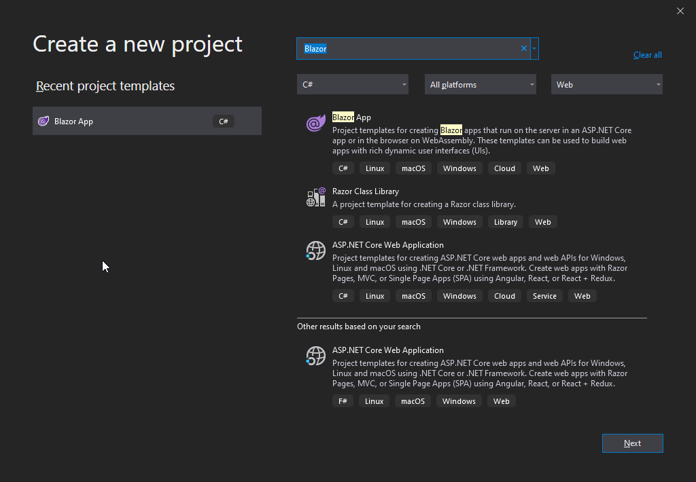
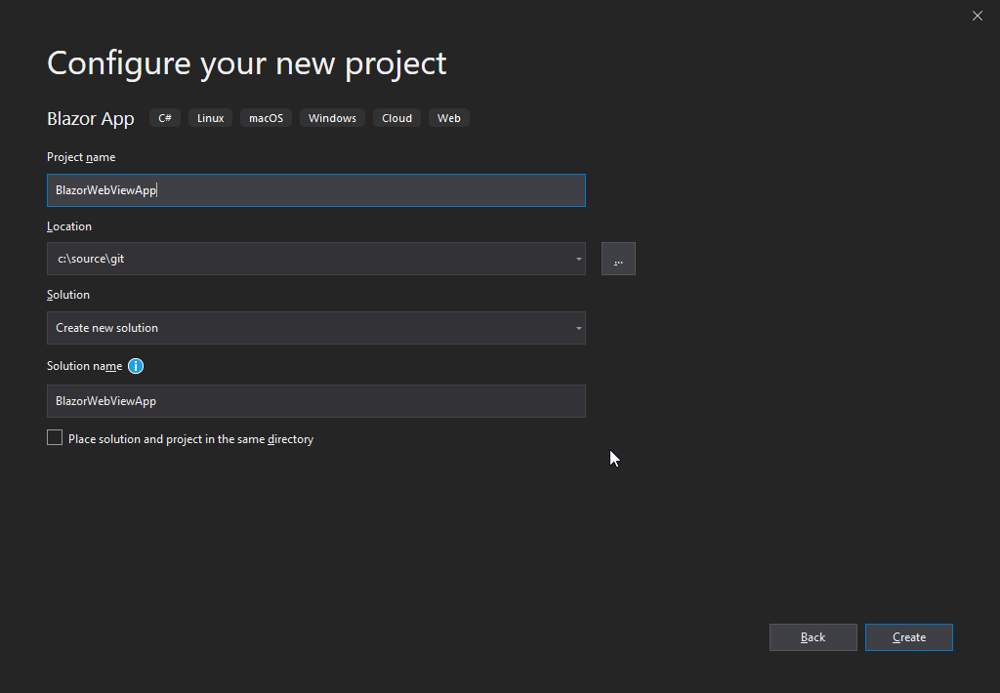
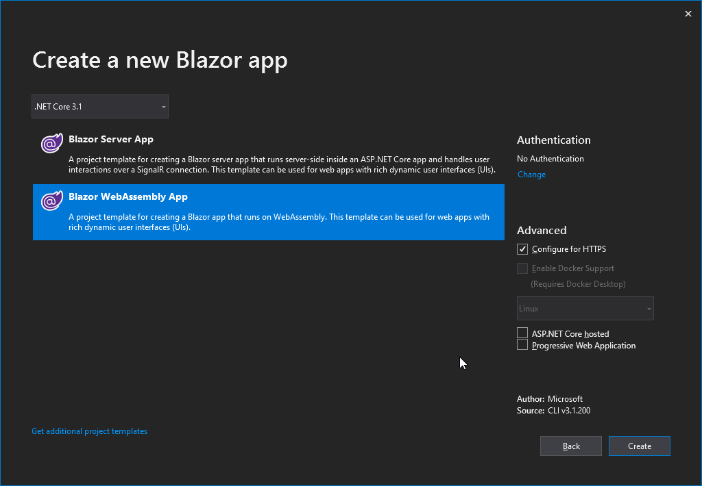
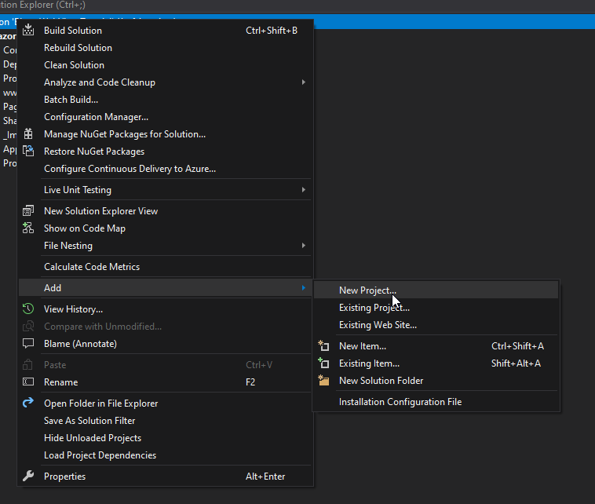
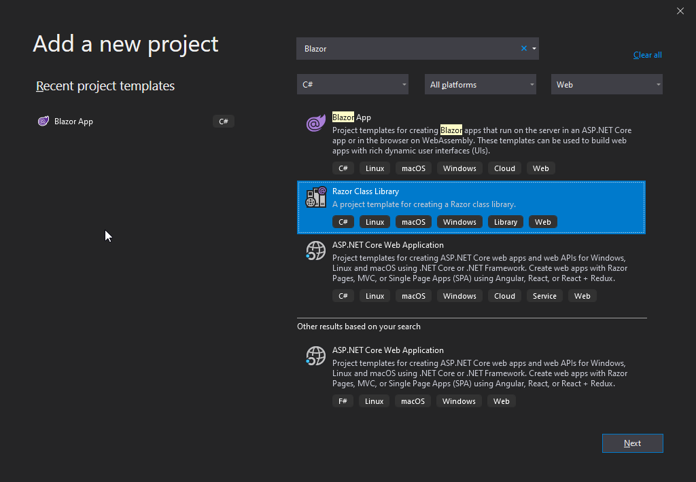
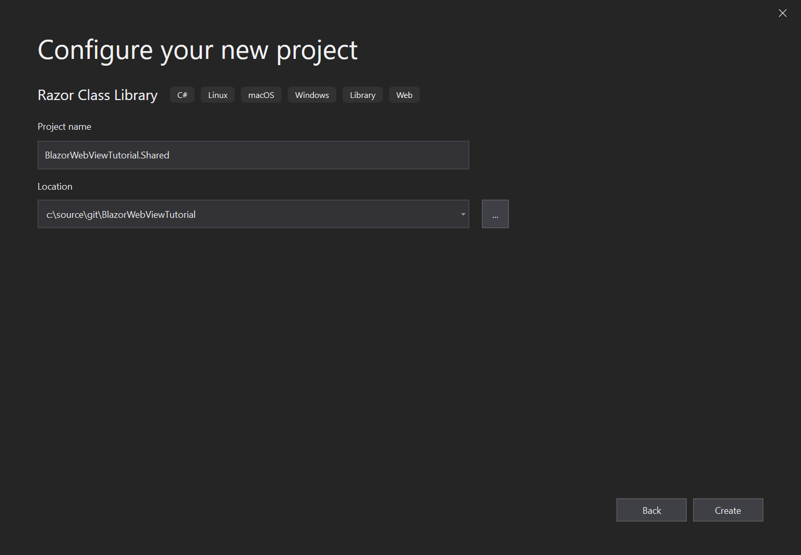
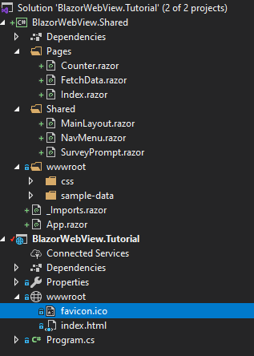
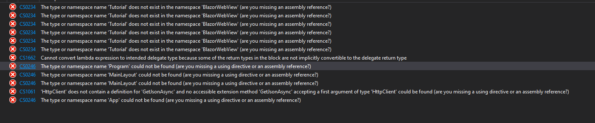
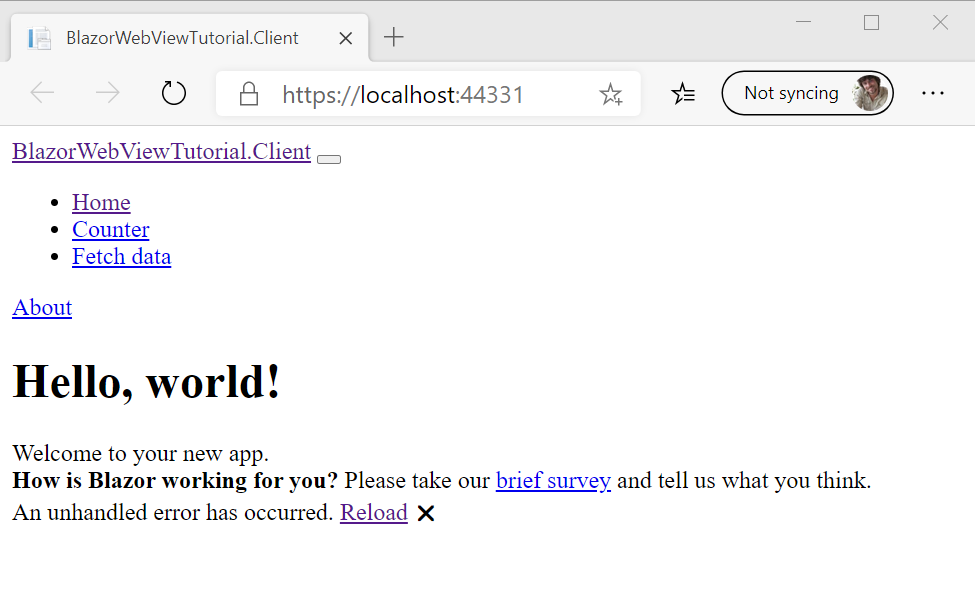

# Prepare a Blazor project

We start the preparations by generating a new Blazor Webassembly project from Visual Studio.
Make sure you have the WebAssembly templates installed by following the [instructions in the
documentation](https://docs.microsoft.com/en-us/aspnet/core/blazor/get-started?view=aspnetcore-3.1&tabs=visual-studio).

>We will use a WebAssembly project for these preparations, but the steps for Server Side
Blazor are roughly the same.

Create a new project using the settings below:

# [Create Page 1](#tab/createpage-1)



# [Create Page 3](#tab/createpage-2)



# [Create Page 3](#tab/createpage-3)



***

## Add a shared RCL project

To prepare a Blazor project for use with a BlazorWebView it is best to move all dynamic
Blazor content to a Razor Class Library, and keep only the static content inside the
WebAssembly project. We do this by adding a new project to the solution first:

# [Add Project 1](#tab/addpage-1)



# [Add Project 2](#tab/addpage-2)



# [Add Project 3](#tab/addpage-3)



***


We can delete all content that has been generated as an example in the RCL project,
as we will move over the content from the WebAssembly project shortly. Don't delete
the wwwroot folder itself, we will use that later on.

Finally add a reference from the WebAssembly project to the shared project:

  * Right click `Dependencies` node in the solution explorer of the WebAssembly project.
  * Select `Add reference...`
  * In the dialog that is opened, click `Projects` and `Solution`.
  * Select your shared RCL project.

## Moving over the neccesary files and folders.

Now move over the following items from the WebAssembly project to the shared project,
leaving only the favicon.ico and index.html files in the wwwroot behind:

* Pages
* Shared
* _Imports.razor
* App.razor
* wwwroot/css
* wwwroot/sample-data

You'll arrive at the following structure:



## Clean up the build errors.

Now build your solution. You'll get a list of build errors that need to be adressed:



We will fix these one by one:

* First we change the namespaces in _Imports.Razor to match the shared library instead of
  the WebAssembly project:

```cshtml-razor
@using System.Net.Http
@using Microsoft.AspNetCore.Components.Forms
@using Microsoft.AspNetCore.Components.Routing
@using Microsoft.AspNetCore.Components.Web
@using Microsoft.JSInterop
<!-- change these last two lines to match the namespaces of your shared library !-->
@using BlazorWebView.Tutorial
@using BlazorWebView.Tutorial.Shared
```
* Next add a nuget reference to `Microsoft.AspNetCore.Blazor.HttpClient` to the shared project
  as well (It is already in the webassembly project).
* Finally we add a using statement to the Program.cs folder in the webassembly project to
  resolve the App class at a new location:
```csharp
using System;
using System.Collections.Generic;
using System.Threading.Tasks;
using System.Text;
using Microsoft.AspNetCore.Components.WebAssembly.Hosting;
using Microsoft.Extensions.DependencyInjection;
// Add this line and have it match the location of the App class.
using BlazorWebView.Shared;

namespace BlazorWebView.Tutorial
{
    public class Program
    {
        public static async Task Main(string[] args)
        {
            var builder = WebAssemblyHostBuilder.CreateDefault(args);
            builder.RootComponents.Add<App>("app");

            builder.Services.AddBaseAddressHttpClient();

            await builder.Build().RunAsync();
        }
    }
}
```

The project should now build without any errors. Let's move on and try to run it:

## Solving some runtime problems

Click Debug or press F5 to build and run the project. A browser page will open that looks like this:



This is because the files we have moved from the webassembly wwwroot folder to the shared project
wwwroot folder are not copied to the output directory. This is why blazor webassembly cannot find
them. The easiest way to solve this, is by editing the shared .csproj file directly. You can do
this by right-clicking the file in the solution explorer and choosing "Edit project file" from
the context menu.
Next add the following content inside the `<project>` tag to change the copy behaviour for all
content inside the wwwroot folder:

```xml
  <ItemGroup>
    <Content Update="wwwroot\**\*">
      <CopyToOutputDirectory>PreserveNewest</CopyToOutputDirectory>
    </Content>
  </ItemGroup>
```

Press F5 again. The project should now build, run and the sample should be in working order.
Congratulations! You've completed the preparations and are ready to move on to one of the
tutorials. The source code so far is in this branch:

